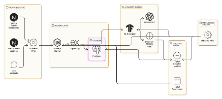

# LEXI AI Chat Assistant with Knowledge Base Backend


This project implements a knowledge-based chat assistant using DeepSeek API. It allows users to create knowledge bases, add knowledge items, and get contextual responses to their questions based on the stored knowledge.

## Project Architecture



The LEXI AI Chat Assistant backend is built with a modern, scalable architecture consisting of the following key components:

### Core Technologies
- **Flask**: Lightweight web framework for building RESTful APIs
- **PostgreSQL**: Relational database for storing user data, knowledge bases, and metadata
- **AWS S3**: Cloud storage for uploaded knowledge documents
- **DeepSeek API**: AI model for generating contextual responses
- **JWT Authentication**: Secure token-based authentication system
- **Alembic**: Database migration management

### System Components
- **User Management**: Registration, login, and role-based access control (Admin, Agent, User)
- **Knowledge Base**: Upload, store, and manage documents for AI training
- **Chatbot Creation**: Build custom chatbots linked to specific knowledge sources
- **Ticket System**: Support ticket management with agent assignment and resolution tracking
- **RAG Service**: Retrieval-Augmented Generation for contextual AI responses
- **Storage Service**: Secure file upload and management with S3 integration

### Key Features
- Multi-user support with role-based permissions
- Document upload and processing (PDF, TXT, images)
- Intelligent chatbot creation and management
- Real-time ticket support system
- Secure API endpoints with JWT authentication
- Scalable cloud storage integration
- Create and manage multiple knowledge bases
- Add, list, and delete knowledge items
- Embed text using Sentence Transformers
- Store metadata in PostgreSQL and vector embeddings in Pinecone
- Generate contextual responses using DeepSeek API
- RESTful API endpoints using Flask

## Prerequisites

- Python 3.12+
- PostgreSQL database
- Pinecone account (for vector database)
- DeepSeek API key

## Installation

### Using Pip and Virtual Environment

If you prefer using pip, you can install the dependencies using the traditional approach:

1. Clone this repository:

```bash
git clone git@github.com:BitBurstAlpha/ai-chatbot-backend.git
cd ai-chatbot-backend
```

2. Create a virtual environment and install dependencies:

```bash
# Create a virtual environment
python -m venv venv

# Activate the environment
# On Unix/macOS:
source venv/bin/activate
# On Windows:
venv\Scripts\activate

# Install dependencies
pip install -r requirements.txt
```

---

## Usage

1. Start the Flask server:

```bash
python wsgi.py
```
